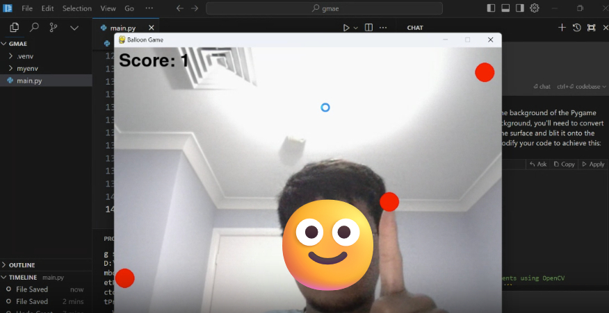

# Balloon Game 🎈

## Overview
Balloon Game is an interactive and fun game where players use their hand movements to pop falling balloons using computer vision. The game uses Pygame for graphics and MediaPipe for hand tracking, creating an engaging experience that challenges players' reflexes and hand-eye coordination.



## Features
- **Hand Tracking**: Uses MediaPipe to detect hand movements and accurately track the index finger's position.
- **Falling Balloons**: Balloons fall from the top of the screen, and players can pop them by touching with their hand.
- **Scoring System**: Players gain points for each balloon popped and lose points if they miss.
- **Sound Effects**: Enjoy delightful pop sounds when balloons are successfully popped.
- **Multiple Levels**: Currently supports one level with the possibility of adding more in future updates.
- **Restart Functionality**: Players can restart the game and play again after finishing.

## Requirements
To run the game, ensure you have the following installed:
- Python 3.6 or later
- Pygame
- OpenCV
- MediaPipe

You can install the required libraries using pip:

```bash
pip install pygame opencv-python mediapipe
git clone https://github.com/your-username/balloon-game.git
cd balloon-game
python main.py
```

## Controls
Popping Balloons: Move your hand to touch the falling balloons. The game tracks your index finger for accurate detection.
Future Enhancements
Adding more levels with varying speeds and difficulty.
Implementing a scoring leaderboard.
Enhancing graphics and sound effects.
Adding additional balloon types and effects.
Contributing
Contributions are welcome! If you'd like to contribute, please fork the repository and submit a pull request. Ensure to follow best practices and document your changes.

## License
This project is licensed under the MIT License - see the LICENSE file for details.

## Acknowledgements
MediaPipe: A framework for building multimodal applied machine learning pipelines.
Pygame: A cross-platform set of Python modules designed for writing video games.
OpenCV: An open-source computer vision and machine learning software library.

